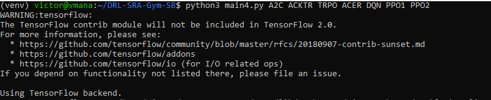

# Gym Stable Baselines Deep Reinforcement Learning for SRA

Solving the SRA problem using the new version of Gym and Stable Baselines algorithms.

This repository does not contain the simulation data, and you should copy them manually! 
Remember to inform the correct simulation data src in ``akpy/MassiveMIMOSystem5.py``

### Installation

#### Prerequisites - Ubuntu

###### Tested in Ubuntu 18.04 with Python 3.6.9

```sh
$ sudo apt-get update && sudo apt-get install cmake libopenmpi-dev python3-dev zlib1g-dev python3-virtualenv python3-pip
```

#### Stable Baselines

````$
$ pip install stable-baselines[mpi]
````

[See Stable Baselines instructions.](https://stable-baselines.readthedocs.io/en/master/guide/install.html)

#### Clone
```sh
$ git clone https://github.com/LABORA-INF-UFG/DRL-SRA-Gym-SB.git
$ cd DRL-SRA-Gym-SB
```


#### Virtual env

```sh
$ virtualenv venv ./venv -p python3
$ source venv/bin/activate
$ pip install --upgrade pip
$ pip install scikit-build
$ pip install -r reqs.txt
```

#### Installing the SraEnv

```shell
$ pip install -e sra-env
```
Make sure to set up the src of the dataset files (channel and traffic) on 
[akpy/MassiveMIMOSystem7.py](https://github.com/LABORA-INF-UFG/DRL-SRA-Gym-SB/blob/master/akpy/MassiveMIMOSystem7.py)

You'll be able to run! If You get the message like in the image below, the environment is done! Don't worry about the warnings! 


