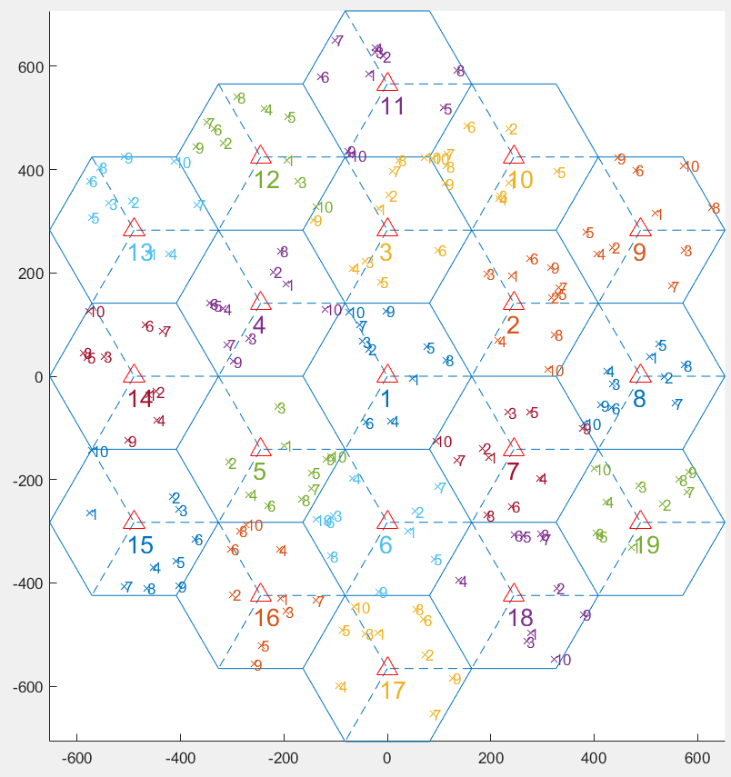

# mimo_channel_gen

#### MIMO channel, traffic, and interference generator.

To streamline training and validation, we assume the use of all data in files (channels, interference, and traffic), instead of generating data at running time.

These files should be stored in _exp1_ folder.

Due to the large size of channel files, we recommend you generate them locally, running mimo_channel_gen/channel_generator/main_channel_gen.m (channels) 
and mimo_channel/traffic_interference_generator/main_traffic_interference_generation.m (traffic and interference).

##### Parameters

The figure below shows the configuration used by this implementation:

* K = 10 Users per cell
* L = 19 Cells
* target_cell_index=1 the cell of interest
* freqs = [24, 28] in GHz
* gain_factors_dB = [0 8] the fading factor for each frequency
* num_episodes = 200 RL episodes
* num_blocks = 100 RL allocation blocks per episode

#### Copyright - see the [License](LICENSE "See the license file")